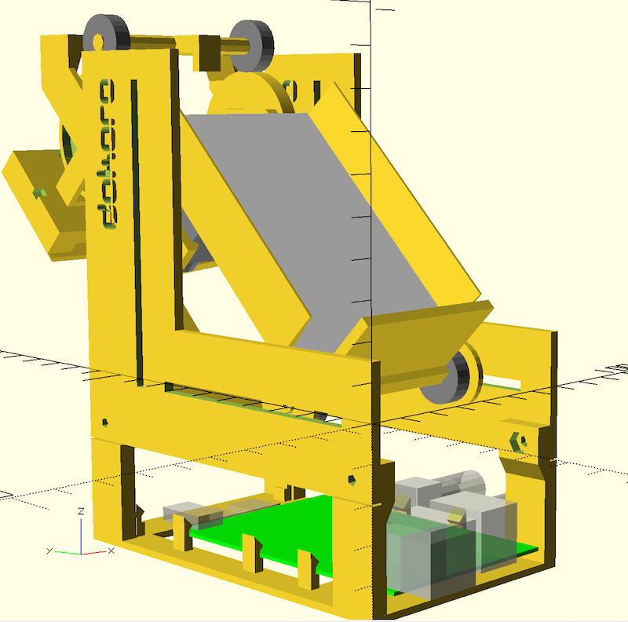

# dokoro
a roboter for playing cards

##idea:
This device should replace a normal player.
It will be possible to play doko without having 4 people at the same table.
The device could act like a normal player, playing with its own intelligence or as an interface for an external player, for example sitting in timbuktu.
In addition it can be used for many different card games. Only a software problem.....

##how it should work:
A human player is distributing the cards. The **dokoro** gets its cards placed in the cardholder.
For scanning these cards it has minimalistic hardware. One motor, one servo and a camera. The cards are moved in front of the camera one by one and an image-recognition is used. [Here](images/dokoroAnimation.mp4) a small animation.

After all the cards are recognized the play could start. A camera watches the playfield. This second view might be part of the first camera view using a mirror(?).
For the intelligence the project [FreeDoko](http://free-doko.sourceforge.net/de/FreeDoko.html) is planed to be used.

##the OpenSCAD construction uses:

###public libraries

[ParametricHerringboneGears.scad](https://github.com/beckdac/PARA/blob/master/ParametricHerringboneGears.scad)  
[pibase.scad](https://github.com/guyc/pi-box/blob/master/pibase.scad)  
[Font/font_DesignerBlock_lo.scad](https://github.com/QuackingPlums/QP_OpenSCAD_lib/blob/master/Makerbot%20font%20(Thingiverse%2022730)/font_DesignerBlock_lo.scad)  
[ISOThreadCust.scad](http://www.thingiverse.com/thing:311919)

###included files

CameraAdapter.scad, based on [piCameraMicroscopeAdapter.scad](https://github.com/luisibanez/ShapesFor3DPrinting/blob/master/OpenSCAD/piCameraMicroscopeAdapter.scad)  
9g_servo.scad  

##additional used parts:

* 4 ball-bearing 625	(at the rubber bands)
* 2 ball-bearing 683	(at the driving axis)
* 2 rubber-bands 130*4mm 
* [gear motor](http://www.ebay.de/itm/DC-1-5-12V-200rpm-Getriebe-Motor-elektrisch-Electric-Metal-Geared-Motor-3v-6v-9v-/231526128396?hash=item35e8085b0c:g:-XUAAOSweW5VJBSc) 12V, 200 U/min
* [mini servo 9g SG90](http://www.ebay.de/itm/ELE-2x-Micro-Mini-Servo-SG90-RC-Servo-9g-Kabel-23cm-Neu-/222005349852) with some parts
* a metal axis 70*3mm
* Raspberry Pi with camera
* electronic for driving the motor and the servo (adafruit motor HAT)
* some screws and washers
	* 2* M3*8 + nut 		(at base frontside)
	* 2* M3*12 + nut 	(at the base backside)
	* 4* M3*6 countersunk +nuts (at the cardholder)
	* M3*25 + nut 		(at the camera arm)
	* 4* threaded rods M3*20 (at gears and driving wheels)
	* 2* washers M3 (at driving axis, between motorholder and driving wheel)

##electronics:
An Adafruit Motor HAT [circuit](https://cdn-learn.adafruit.com/assets/assets/000/022/655/original/raspberry_pi_schem1.png?1422045515) [instructions](https://learn.adafruit.com/adafruit-dc-and-stepper-motor-hat-for-raspberry-pi) is used for driving the DC-motor and the servo.
The DC motor is connected to M3, the servo is driven by the PWM of the Raspi with an aditional 5V regulator.

##other ideas:
A monitor could be used to show informations, a speaker for giving _valuable comments_. When the dokoro is used as an interface, these parts could be used to get a real connection to the remote player.  
The main focus is an easy to use device without any unnecessary interface. Speach recognition could be a good way to make some necessary inputs like anouncing solos, wedding, ... 

##current status:
The hardware seems to work. Cards could be moved by the driven rubber bands. The servo is mechanically able to move the cards and the whole flow of scanning the cards seems possible.  
FreeDoko could be compiled and the place of the missing interface is clear.  
Next step is connecting the raspbi to drive motor and servo.
Im searching for help in every project part. Help is given when someone tries to build his own example for development.  
__There is no working example available (up to now).__  

##challenges:
The reliability of the mechanic is not easy. All moving parts are constructed with ball bearings. The separation of cards might be difficult, especially when dirty cards will be allowed.  
Getting the interface to the Freedoko source might be easy. There is a network-player option which matches perfectly. The server has to the changed in the way that cards are not in the program but on the table.  
The use as an interface for external players will be a big place for software development.   

##licensing
The project is licenced using GPL2.

Enjoy it.... Klaus 
